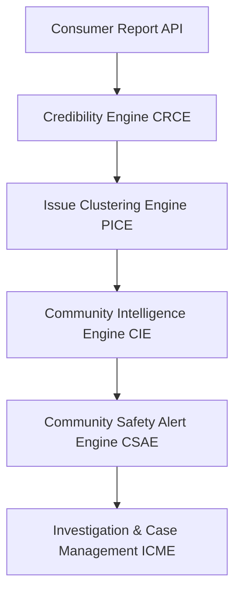

# System Architecture — Product Guardian Network (PGN)

This document describes the design patterns, boundaries, and data pipelines of the PGN platform.

---

## 1. Overview
The PGN backend is a microservice-inspired FastAPI application modularized cleanly into community intelligence and safety workflow subsystems. It is built to support:
- High-concurrency packaged product incident reporting.
- Real-time automated data validation and credibility profiling.
- Cascading event pipelines triggering issue clustering, intelligence analytics, and safety alert generation.
- Dynamic case management investigations and audit trail tracking.

---

## 2. Core Subsystems

### 2.1 Consumer Report Credibility Engine (CRCE)
- **Objective**: Determine validation profiles and assign a Credibility Score ($0-100$) to every product report.
- **Pipeline**: On report submission, calculates factors (barcode, batch presence, description lengths, verified user check, receipt proof images check) and subtracts duplicates penalty.

### 2.2 Product Issue Clustering Engine (PICE)
- **Objective**: Link matching reports to Issue Clusters rather than tracking them independently.
- **Matching Rules**: Group on same barcode, batch number, report type, and within a 30-day chronological window.

### 2.3 Community Intelligence Engine (CIE)
- **Objective**: Track growth rates, trends (STABLE, GROWING, RAPIDLY_GROWING), spread levels (LOCAL, REGIONAL, NATIONAL), and risk scores across issue clusters.
- **Trigger**: Runs automatically right after a cluster is updated.

### 2.4 Community Safety Alert Engine (CSAE)
- **Objective**: Trigger safety warning alerts to the community dynamically when threat criteria are matched.

### 2.5 Investigation & Case Management Engine (ICME)
- **Objective**: Enable case officer assignment, note entries, timeline logs, and evidence logs on safety alerts.

---

## 3. Database Architecture
- **DBMS**: PostgreSQL 16+ (Docker-native container).
- **Pooling**: Connection pools configured via SQLAlchemy with automated connection verification ping probes (`pool_pre_ping=True`).
